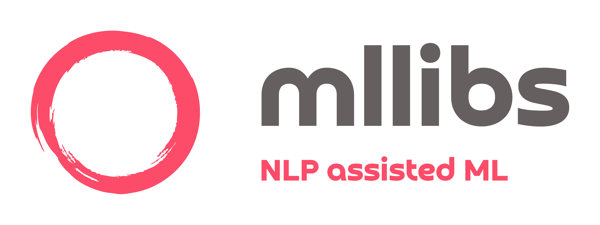

<p align="center">
    
</p>

<h5 align="center">
    
  [](https://github.com/shtrausslearning/mllibs/releases)
[](#license "Go to license section")

</h5>

### About mllibs

Some key points about the library:

- <code>mllibs</code> is a Machine Learning (ML) library which utilises natural language processing (NLP)
- Development of such helper modules are motivated by the fact that everyones understanding of coding & subject matter (ML in this case) may be different 
- Often we see people create `functions` and `classes` to simplify the process of code automation (which is good practice)
- Likewise, NLP based interpreters follow this trend as well, except, in this case our only inputs for activating certain code is `natural language`
- Using python, we can interpret `natural language` in the form of `string` type data, using `natural langauge interpreters`
- <code>mllibs</code> aims to provide an automated way to do machine learning using natural language

### Code Automation

#### Types of Approaches

There are different ways we can automate code execution:
- The first two (`function`,`class`) should be familiar, such approaches presume we have coding knowledge.
- Another approach is to utilise `natural language` to automate code automation, this method doesn't require any coding knowledge. 

#### (1) Function 

Function based code automation should be very familiar to people who code, we define a function & then simply call the function, entering any relevant input arguments which it requires, in this case `n`

#### (2) Class 

Another common approach to automate code is using a class based approach. Utilising `OOP` concepts we can initialise & then call class `methods` in order to automate code:

#### (3) Natural Language

Another approach, which `mllibs` uses in natural language based code automation:

<table>
    
<tr>
<td> <code>function</code> </td> <td> <code>class</code> </td> <td> <code>natural language</code> </td>
</tr>

<tr>
<td>

```python
def fib_list(n):
    result = []
    a,b = 0,1
    while a<n:
        result.append(a)
        a,b = b, a + b
    return result

fib_list(5) 
```
    
</td>
<td>
    
```python

class fib_list:
    
    def __init__(self,n):
        self.n = n

    def get_list(self):
        result = []
        a,b = 0,1
        while a<self.n:
            result.append(a)
            a,b = b, a + b
        return result

fib = fib_list(5)
fib.get_list()
```

</td>

<td>

```python
input = 'calculate the fibonacci'
         sequence for the value of 5'

nlp_interpreter(input) 
```
    
</td>

<tr>
<td> <code>[0, 1, 1, 2, 3]</code> </td> <td> <code>[0, 1, 1, 2, 3]</code> </td> <td> <code>[0, 1, 1, 2, 3]</code> </td>
</tr>

</tr>
</table>

### **How to Contibute**

Want to add your own project to our collection? We welcome all contributions, big or small. Here's how you can get started:

1. Fork the repository
2. Create a new branch for your changes
3. Make your changes and commit them
4. Submit a pull request

